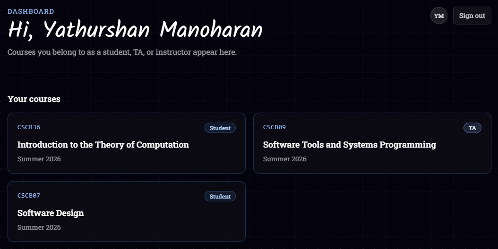
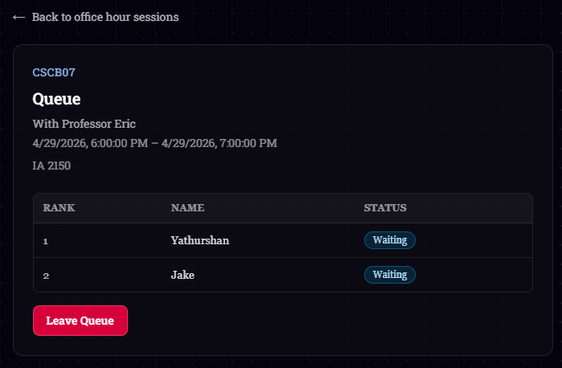

# Kue

**Kue** is a web app for managing **course office hours**: students see scheduled sessions, join a **live queue**, and teaching staff run the line in order - without having students to wait a long line till they get their turn.

---

## Why Kue?

During my first term at UofT, I waited 2 hours in a CSCA67 office hours line, only to leave without getting help when the session ended. I wasn't alone - students would stand in hallways for 30-60 minutes, unsure if they'd even get seen.

Talking to fellow students, it was clear they wanted a system that could:

- Show everyone's position clearly
- Let students wait elsewhere (library, dorm) instead of in a hallway
- Track common questions to improve future lectures

So I built **Kue**.

---

## Key Features

**For Students:**

- **Magic link login** - no passwords, validates UofT emails only
- **See your position** in queue + estimated wait time
- **Join from anywhere** - no physical line required
- **Mobile responsive** - works on phone while studying

**For TAs:**

- **Queue at a glance** - see all waiting students + their questions
- **One-click "Next"** - automatically moves queue forward
- **Usage analytics** - busiest times, common questions, avg help duration (upcoming)

**For Instructors:**

- **Schedule sessions** - set up recurring office hours
- **Assign TAs** - delegate queue management
- **Historical data** - see which topics need more coverage (upcoming)

---

## Screenshots

### Student View


_Students see their courses with role badges_


_Join the queue, see your position, leave if needed_

### TA View

_TAs see all waiting students, click "Next" to help_

### Instructor View

_Instructors can add students/TAs/other instructors to this course and add
more office hour sessions_

---

## Tech Highlights

**Challenges solved:**

1. **Live queue sync without WebSockets**
    - Polling strategy - the UI **polls** the queue endpoint on an interval so multiple browsers stay loosely in sync
    - Plan to migrate to Supabase Realtime for true push updates

2. **Role-based permissions at scale**
    - Student can be TA in one course, student in another
    - Implemented via `CourseMembership` junction table
    - API routes validate role per-request via NextAuth session

3. **Queue ordering logic**
    - In-progress students shown first (TAs see who they're helping)
    - Waiting students auto-ranked by join time
    - Centralized in `lib/queue-session.ts` for consistency

**Tech choices:**

- **Next.js App Router** over separate backend - shares types, no CORS, one deployment
- **Prisma** over raw SQL - type safety, migrations, easier to maintain
- **Magic links** over passwords - better UX, no password resets, validates email ownership

---

## Tech stack

| Layer     | Choice                                                                                       |
| --------- | -------------------------------------------------------------------------------------------- |
| Framework | **Next.js** 16 (App Router), **React** 19, **TypeScript**                                    |
| Styling   | **Tailwind CSS** 4                                                                           |
| Database  | **PostgreSQL** via **Prisma** 7 (`@prisma/adapter-pg`)                                       |
| Auth      | **Supabase Auth** (magic link / OTP email), **@supabase/ssr** for server and browser clients |
| API       | Next.js **Route Handlers** (`app/api/...`)                                                   |

---

## Local development

### Prerequisites

- **Node.js** (LTS recommended)
- A **PostgreSQL** database (local or hosted; [Supabase](https://supabase.com) Postgres works well)
- A **Supabase** project for authentication (URL + anon/publishable key)

### Environment variables

Create `.env.local` in the project root (see [Prisma config](prisma.config.ts) for `dotenv` loading):

| Variable                               | Purpose                                                                                                                                                             |
| -------------------------------------- | ------------------------------------------------------------------------------------------------------------------------------------------------------------------- |
| `DATABASE_URL`                         | Postgres connection string for the **runtime** app (used by Prisma in `lib/prisma.ts`).                                                                             |
| `DIRECT_URL`                           | Optional; used by **Prisma CLI** migrations when a pooled URL is unsuitable (see `prisma.config.ts`). If unset, ensure migrations work against your `DATABASE_URL`. |
| `NEXT_PUBLIC_SUPABASE_URL`             | Supabase project URL                                                                                                                                                |
| `NEXT_PUBLIC_SUPABASE_PUBLISHABLE_KEY` | Supabase anon / publishable key                                                                                                                                     |

Configure **Supabase Auth** redirect URLs for your app origin (e.g. `http://localhost:3000/auth/callback` in development).

### Commands

```bash
npm install
npx prisma migrate dev    # apply schema to your database
npm run dev               # http://localhost:3000
```
